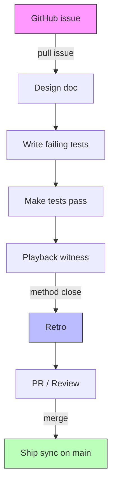
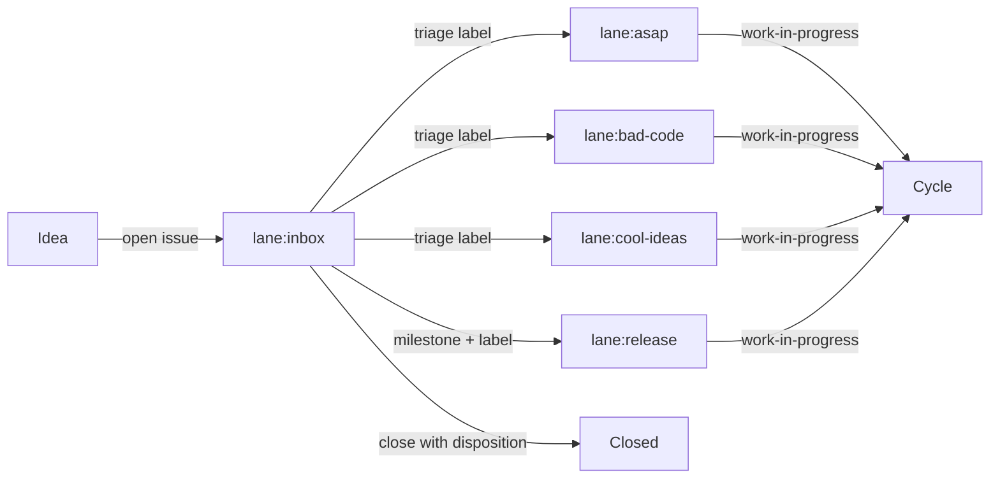
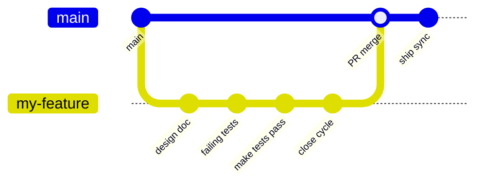
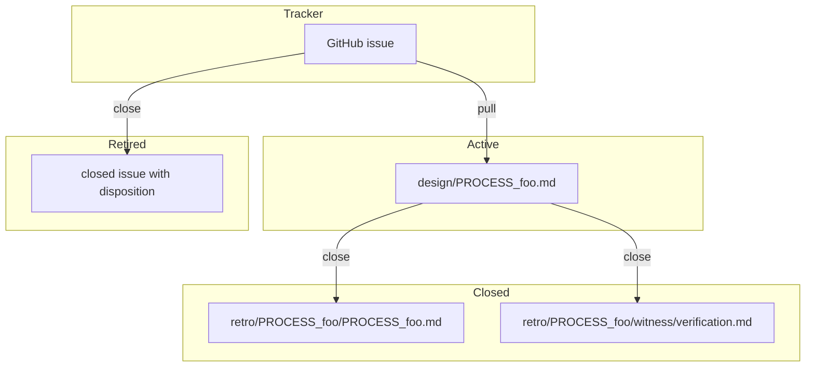
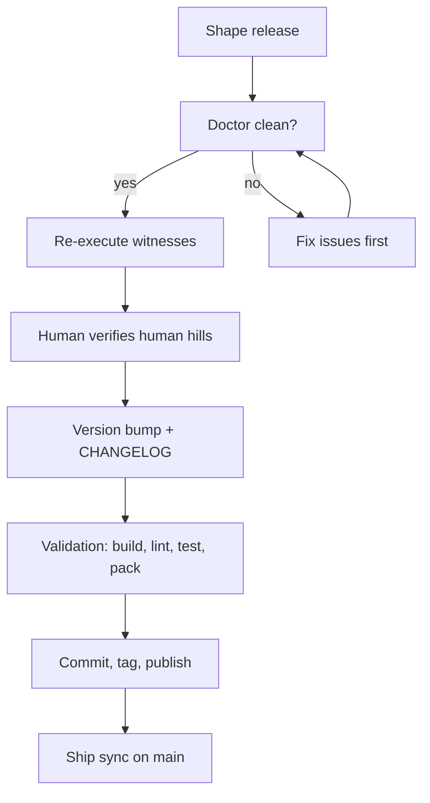

# Guide

A practical guide to working in a METHOD repo. For doctrine, see
[`docs/PROCESS.md`](PROCESS.md). For release procedures, see
[`docs/RELEASE.md`](RELEASE.md).

## Getting started

```bash
# Install
npm install @flyingrobots/method

# Initialize a workspace
method init .

# Check workspace health
method doctor

# See live work
gh issue list --label lane:asap
```

## The cycle lifecycle

Every unit of shipped work follows the same loop:



## Issue flow

Ideas enter GitHub Issues, get triaged with lane labels, and eventually
get pulled into cycles or closed with a disposition:



## Cycle branches



## Evidence lifecycle



## Common commands

| Task | Command |
|------|---------|
| Capture an idea | Open a GitHub issue with `lane:inbox` |
| Move between lanes | Change the issue `lane:*` label |
| Mark active work | Add `work-in-progress` |
| Create branch | Use the issue title slug |
| Pull into a cycle | Link the issue from the design doc |
| Check drift | `method drift` |
| Close a cycle | `method close --drift-check yes --outcome hill-met` |
| Retire an item | Close the issue with a disposition comment |
| Check workspace health | `method doctor` |
| Generate health receipt | `method doctor --receipt` |
| Refresh generated docs | `method sync refs` |
| Ship sync after merge | `method sync ship` |
| Capture a spike | `method spike "Prove X works under Y"` |
| See what's next | `method next` |

See [`docs/CLI.md`](CLI.md) for the full command reference.

## Release flow



See [`docs/RELEASE.md`](RELEASE.md) for the full release doctrine and
runbook.

## Practical advice

### Capture ideas immediately

If a work-worthy idea surfaces during work, capture it now as a GitHub
Issue. Do not leave it in chat or assume you'll remember it later.

```bash
gh issue create --label lane:inbox
```

### Keep one raw-intake path

Review notes, critique, and outside-in observations all go to
GitHub Issues with provenance in the issue body or comments when it
matters. Don't invent parallel holding areas.

Filesystem backlog commands still exist for migration and legacy repos,
but new Method work should start in GitHub Issues.

### Advice is not doctrine

This guide is for patterns that help in practice but are not yet strong
enough to claim as universal rules. [`docs/PROCESS.md`](PROCESS.md) is
the load-bearing contract.

## Signposts

<!-- generate:signpost-inventory -->
| Signpost | Type | Description |
|----------|------|-------------|
| `README.md` | Hand-authored | Core doctrine and filesystem shape. |
| `ARCHITECTURE.md` | Hybrid | How the source code is organized. |
| `docs/BEARING.md` | Generated | Current direction and recent ships. |
| `docs/VISION.md` | Generated | Bounded executive synthesis. |
| `docs/CLI.md` | Hybrid | CLI command reference. |
| `docs/MCP.md` | Hybrid | MCP tool reference. |
| `docs/GUIDE.md` | Hybrid | Operator advice with generated sections. |
| `docs/PROCESS.md` | Hand-authored | Cycle doctrine, rules, and workflow. |
| `docs/RELEASE.md` | Hand-authored | Release doctrine and runbook. |
<!-- /generate -->
