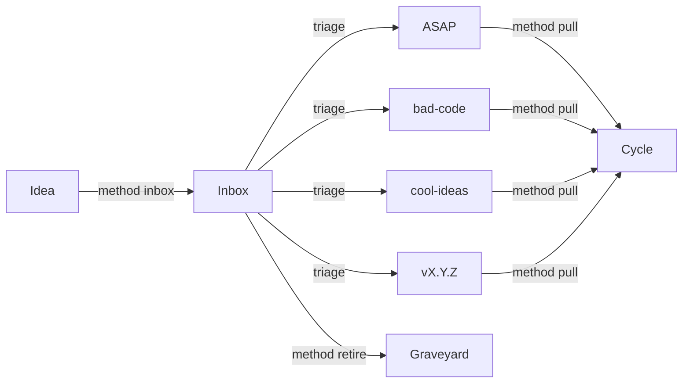
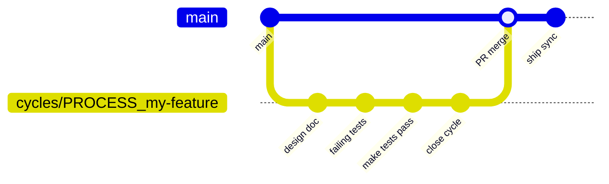
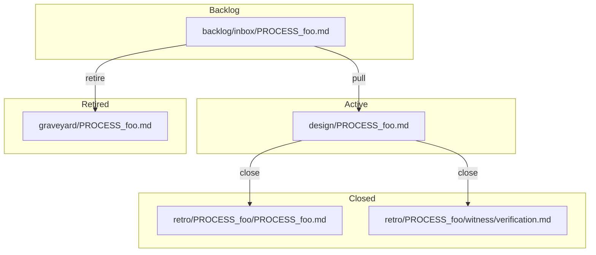
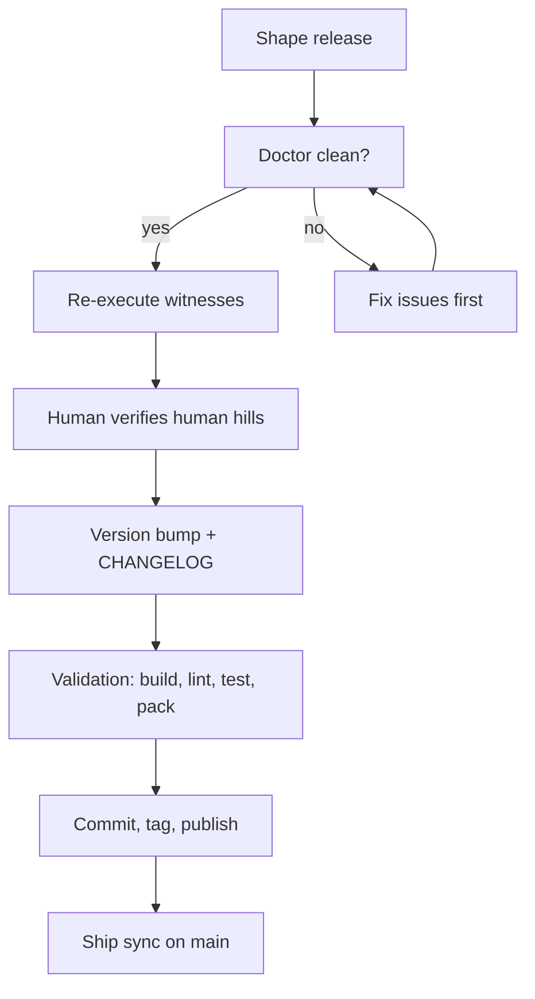

# Guide

A practical guide to working in a METHOD repo. For doctrine, see
[`docs/PROCESS.md`](PROCESS.md). For release procedures, see
[`docs/RELEASE.md`](RELEASE.md).

## Getting started

```bash
# Install
npm install @flyingrobots/method

# Initialize a workspace
method init .

# Check workspace health
method doctor

# See what's on the backlog
method status
```

## The cycle lifecycle

Every unit of shipped work follows the same loop:


## Backlog flow

Ideas enter the inbox, get triaged into lanes, and eventually get
pulled into cycles or retired to the graveyard:



## Cycle branches



## File lifecycle



## Common commands

| Task | Command |
|------|---------|
| Capture an idea | `method inbox "idea" --legend PROCESS` |
| Add shaped backlog item | `method backlog add --lane asap --title "Title" --legend PROCESS` |
| Move between lanes | `method backlog move PROCESS_foo --to asap` |
| Pull into a cycle | `method pull PROCESS_foo` |
| Check drift | `method drift` |
| Close a cycle | `method close --drift-check yes --outcome hill-met` |
| Retire an item | `method retire PROCESS_foo --reason "Replaced by X" --yes` |
| Check workspace health | `method doctor` |
| Generate health receipt | `method doctor --receipt` |
| Refresh generated docs | `method sync refs` |
| Ship sync after merge | `method sync ship` |
| Capture a spike | `method spike "Prove X works under Y"` |
| See what's next | `method next` |

See [`docs/CLI.md`](CLI.md) for the full command reference.

## Release flow



See [`docs/RELEASE.md`](RELEASE.md) for the full release doctrine and
runbook.

## Practical advice

### Capture ideas immediately

If a backlog-worthy idea surfaces during work, capture it now. Do not
leave it in chat or assume you'll remember it later.

```bash
method inbox "the idea" --legend PROCESS
```

### Keep one raw-intake path

Review notes, critique, and outside-in observations all go to
`method inbox` with `--source` and `--captured-at` when provenance
matters. Don't invent parallel holding areas.

### Advice is not doctrine

This guide is for patterns that help in practice but are not yet strong
enough to claim as universal rules. [`docs/PROCESS.md`](PROCESS.md) is
the load-bearing contract.

## Signposts

<!-- generate:signpost-inventory -->
| Signpost | Type | Description |
|----------|------|-------------|
| `README.md` | Hand-authored | Core doctrine and filesystem shape. |
| `ARCHITECTURE.md` | Hybrid | How the source code is organized. |
| `docs/BEARING.md` | Generated | Current direction and recent ships. |
| `docs/VISION.md` | Generated | Bounded executive synthesis. |
| `docs/CLI.md` | Hybrid | CLI command reference. |
| `docs/MCP.md` | Hybrid | MCP tool reference. |
| `docs/GUIDE.md` | Hybrid | Operator advice with generated sections. |
<!-- /generate -->
